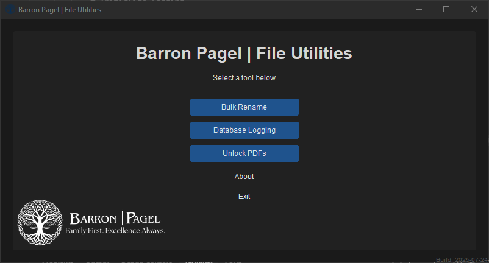
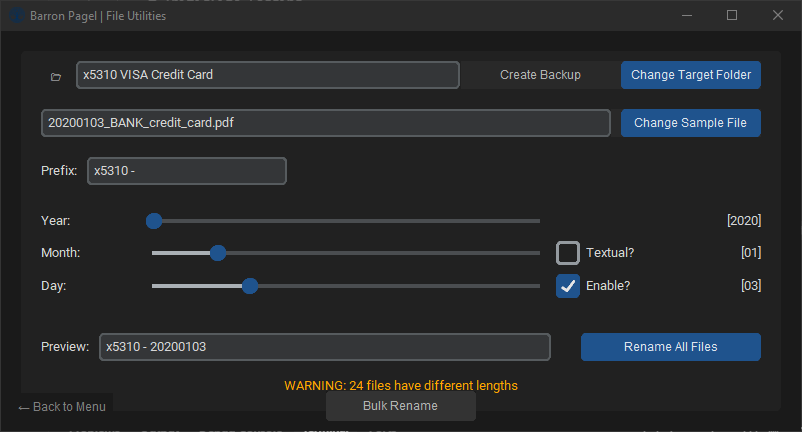
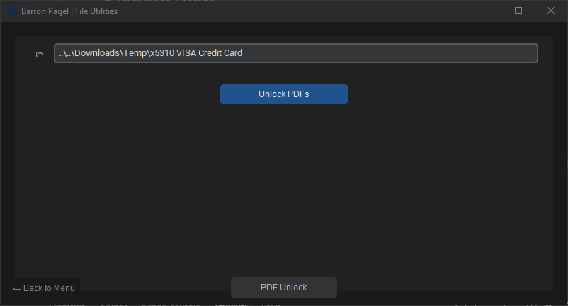

# 🗂️ Barron Pagel File Utilities

A Python GUI suite for various file utilities, originally developed for bulk file processing of bank statements during the discovery process in family law cases. Currently includes tools for **bulk renaming** and **PDF unlocking**, with more features planned like Database Logging (not yet implemented).

---



---

## ✅ Features
- **Modular tool suite**: Bulk Rename, PDF Unlock, Database Logging (coming soon)
- **CustomTkinter GUI** with Barron Pagel branding and logo
- **Main menu** for easy tool selection
- **Bulk Rename Tool**:
  - Position-based date extraction (Year, Month, Day)
  - Textual month normalization (e.g., "January" → "01")
  - Optional day extraction
  - Filename length enforcement
  - Duplicate prevention (`_1`, `_2`, etc.)
  - Real-time rename preview
  - Undo last rename operation
  - Backup functionality (internal .zip, no 3rd-party tools)
- **PDF Unlock Tool**:
  - Remove security restrictions from all PDFs in a folder
  - Handles digital signatures, edit restrictions, permissions
  - Overwrites originals with unlocked versions
- **Database Logging Tool**: Client management with SQLite database, active/archived client filtering, add new clients.
- **Robust error handling** and user feedback (toasts, dialogs)
- **Modern, branded UI** with logo and custom icon

---

## 📦 Installation
### Clone the Repository:
```bash
git clone https://github.com/BylliGoat/batchRename.git
cd batchRename
```

### Install Dependencies:
Create a virtual environment (recommended):
```bash
python -m venv .venv
.\.venv\Scripts\activate
pip install -r requirements.txt
```

### Requirements:
- **python==3.12**
- **customtkinter==5.2.2**
- **pikepdf==9.10.2**
- **pytest==8.4.1**

---

## 🚀 Running the Application
```bash
python main.py
```

---

## 🏠 Main Menu & Tool Selection
- On launch, you'll see the main menu with the Barron Pagel logo.
- Select a tool:
  - **Bulk Rename**: Rename files using date extraction and custom rules.
  - **PDF Unlock**: Remove security from all PDFs in a folder.
  - **Database Logging**: Manage client information and track bank statements

---

## 📝 Bulk Rename Tool


- Select a target folder and sample file.
- (Optional) Create a backup (.zip) before renaming.
   - Note: Backups are currently saved to a ‘Renamer Backups’ folder in your Downloads directory. A future update will allow you to choose the backup location.
- Set prefix, enable textual month normalization (this will trigger automatically if it is necessary), and adjust sliders for Year, Month, Day.
- Preview the new filename format in real time.
- Click **Rename All Files** to process.
- Use **Undo Last Rename** to revert the most recent batch operation.
- Skipped/invalid files and duplicates are handled automatically.

### Example Workflow
**Before:**
```
Spend-Statement-123456789-2021-07-22.pdf
Spend-Statement-123456789-2022-08-23.pdf
```
**After:**
```
20210722.pdf
20220823.pdf
```
With prefix:
```
x1234 - 20210722.pdf
x1234 - 20220823.pdf
```

---

## 🔓 PDF Unlock Tool


- Select a folder containing PDFs.
- Click **Unlock PDFs** to remove security restrictions from all files in the folder.
- Overwrites originals with unlocked, fully editable versions.
- Handles digital signatures, edit restrictions, and permissions.

---

## 🗄️ Database Logging Tool
- **Client Management**: Add, view, and manage client information
- **SQLite Database**: Data stored in `~/.bpfu/database/clients.db`
- **Active/Archived Filtering**: Toggle between active and archived clients
- **Add New Clients**: Simple dialog for adding new clients with first name, last name, and active status
- **Future Features**: Bank statement analysis and tracking (coming soon)

---

## 🧪 Testing
Run the test suite:
```bash
python -m pytest
```
Run tests with coverage report:
```bash
python -m pytest --cov=batch_renamer
```
Note: The test suite was primarily for personal practice and has not been updated recently. It may be removed in a future release.

---

## 🛠 Build Standalone Executable
```bash
pyinstaller --onefile --windowed --name BPFileUtilities main.py
```
Output: `/dist/BPFileUtilities.exe`

---

## 🚧 Future Plans
- Database logging and reporting
- Drag-and-drop support
- Additional file utilities
- Enhanced logging and audit trails

---

## 📜 License
This project is licensed under the **MIT License**.

---

## 📬 Contact
GitHub: [https://github.com/BylliGoat/batchRename](https://github.com/BylliGoat/batchRename)