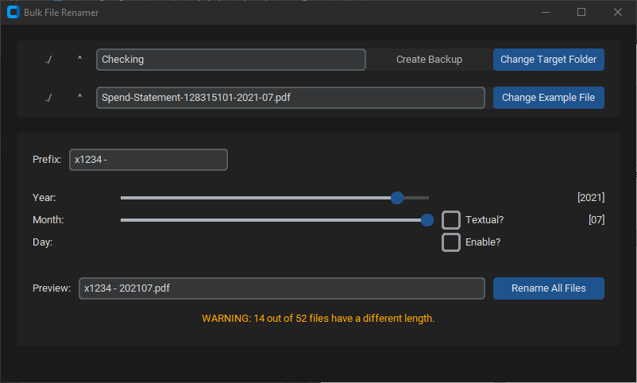

# 📂 batchRename

A Python GUI application designed to **bulk rename PDF files** based on **position-based date extraction**. Built for **legal discovery responses** or document processing where consistent renaming is required.

---



---
## ✅ Features
- **CustomTkinter GUI** for ease of use
- **Position-based parsing** for extracting Year, Month, and optional Day from filenames
- **Textual Month normalization** (e.g., `"January"` → `"01"`)
- **Optional Day extraction toggle**
- **Filename length enforcement** to skip invalid files
- **Duplicate prevention** with auto appending (`_1`, `_2`, etc.)
- **Real-time rename preview**
- **Summary of renamed and skipped files**
- **Backup functionality** (using 7-Zip)

---

## 📦 Installation
### Clone the Repository:
```bash
git clone https://github.com/BylliGoat/batchRename.git
cd batchRename
```

### Install Dependencies:
Create a virtual environment (recommended):
```bash
python -m venv .venv
.\.venv\Scripts\activate
pip install -r requirements.txt
```

### Requirements:
- **Python 3.9+**
- **customtkinter==5.2.0**
- **7-Zip (optional, for backup)** — `7z.exe` must be on your system `PATH`

---

## 🗜 Backup Dependency:
For the backup feature, ensure:
- **7-Zip installed**: [https://www.7-zip.org/download.html](https://www.7-zip.org/download.html)
- **7z.exe added to your system PATH**

Test by running:
```powershell
7z
```
If the command runs, you’re good to go.

---

## 🚀 Running the Application
```bash
python main.py
```
Follow the GUI prompts to:
1. Select a sample file
2. Adjust slider positions for Year, Month, Day
3. (Optional) Normalize textual months
4. Preview the new filename
5. Run the bulk rename

---

## 🧠 Example Workflow
### Before:
```
Spend-Statement-128315101-2021-07.pdf
Spend-Statement-128315101-2022-08.pdf
```
### After:
```
202107.pdf
202208.pdf
```

- Duplicate target filenames automatically renamed with `_1`, `_2`, etc.

---

## 🔨 Optional: Build Standalone Executable
```bash
pyinstaller --onefile --windowed --name batchRename main.py
```
✅ Output: `/dist/batchRename.exe`

---

## 🛠 Future Improvements (Optional):
- Undo functionality
- Logging renamed files
- Drag-and-drop support
- More flexible parsing rules

---

## 📜 License
This project is licensed under the **MIT License**.

---

## 📬 Contact
GitHub: [https://github.com/BylliGoat/batchRename](https://github.com/BylliGoat/batchRename)